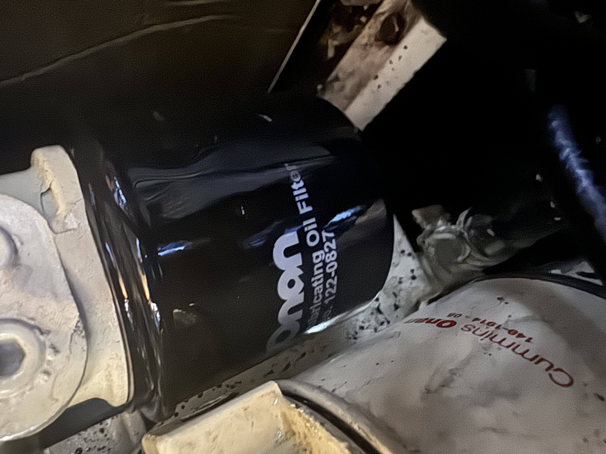

## an oily situation

## an oily situation

One of the first bits of maintenance we did was an overhaul of the generator. It was in real need of a service - the heat exchanger was completely clogged. The coolant was more particles than liquid, and the rest of it was in a surprisingly rough condition considering it really only had 1300 hours on it. We swapped all the fluids, changed the impeller, gave it a good cleaning - the works. 

This turned out to be a mistake. Almost immediately, it proved to be troublesome. The diesel lines in kept sucking air - causing it to shut off randomly. The filters that had been left with the boat didn't fit quite right - causing an oily mess. 

The worst problem however, was that it seemed like every single gasket had simultaneously failed. The generator now had a slow, consistent leak - with the core of it being between the dynamo & the engine block. This generator was a large, bulky thing - near impossible to properly work, even in our admittedly large engine room. This oil leak caused other problems as well. Right below the generator - and more importantly below a hole in its catch pan lives the shift linkage for the main engine. 

> [!hint]- pan-pan, pan-pan, pan-pan - I am in the fish, I am in the fish
> On our way to anchor we heard a weird radio call on 16. Someone calling out a [pan-pan](https://en.wikipedia.org/wiki/Pan-pan) with a curious message - "I am in the fish". This turned out to be a some poor souls who had gone straight into one of the local fish farms. Still not quite sure how they pulled that off - however we did end up seeing them as they were pulled out by the coast guard. We ended up following them into the anchorage - where the authorities lingered around their boat to "chat" for a good while. 

You can imagine my surprise when I was attempted to maneuver to anchor - and the throttle no longer does anything. Happily - I was right near the anchorage at this point. A bit of inertia, a bit of the bow thruster, and I managed to get an "alright" spot. Only mildly stressful - especially considering the Greek coast guard was right in front of us dealing with another boat who was "in the fish" a moment prior. 

The oil had leaked onto the linkage, and had slowly come out. A couple twists of the wrench - and the throttle was back in action. Happily a quick fix. 

## an oily situation

One of the first bits of maintenance we did was an overhaul of the generator. It was in real need of a service - the heat exchanger was completely clogged. The coolant was more particles than liquid, and the rest of it was in a surprisingly rough condition considering it really only had 1300 hours on it. We swapped all the fluids, changed the impeller, gave it a good cleaning - the works. 

This turned out to be a mistake. Almost immediately, it proved to be troublesome. The diesel lines in kept sucking air - causing it to shut off randomly. The filters that had been left with the boat didn't fit quite right - causing an oily mess. 

The worst problem however, was that it seemed like every single gasket had simultaneously failed. The generator now had a slow, consistent leak - with the core of it being between the dynamo & the engine block. This generator was a large, bulky thing - near impossible to properly work, even in our admittedly large engine room. This oil leak caused other problems as well. Right below the generator - and more importantly below a hole in its catch pan lives the shift linkage for the main engine. 

> [!hint]- pan-pan, pan-pan, pan-pan - I am in the fish, I am in the fish
> On our way to anchor we heard a weird radio call on 16. Someone calling out a [pan-pan](https://en.wikipedia.org/wiki/Pan-pan) with a curious message - "I am in the fish". This turned out to be a some poor souls who had gone straight into one of the local fish farms. Still not quite sure how they pulled that off - however we did end up seeing them as they were pulled out by the coast guard. We ended up following them into the anchorage - where the authorities lingered around their boat to "chat" for a good while. 

You can imagine my surprise when I was attempted to maneuver to anchor - and the throttle no longer does anything. Happily - I was right near the anchorage at this point. A bit of inertia, a bit of the bow thruster, and I managed to get an "alright" spot. Only mildly stressful - especially considering the Greek coast guard was right in front of us dealing with another boat who was "in the fish" a moment prior. 

The oil had leaked onto the linkage, and had slowly come out. A couple twists of the wrench - and the throttle was back in action. Happily a quick fix. 