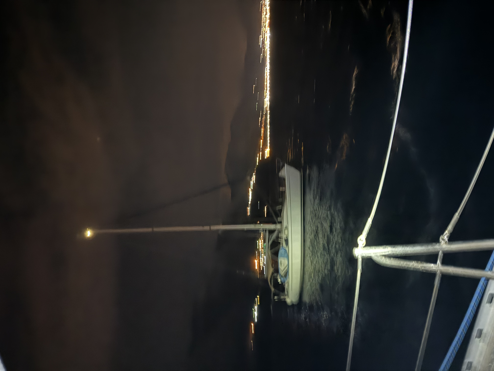

Dropping anchor should be simple, however it is an act that must be done with great care.

So far, I have had only two really "interesting" experiences at anchor.

The really stressful one was when we were tied to shore on the south of Ithaca. We had tied up in a cove; alongside 11 other yachts. Forecasts suggested light winds. You can imagine my surprise when 30+ knot gusts started shoving us to shore at around 1:30am. A tightly set anchor alarm, a quick reaction & assistance of others onboard prevented that from being a true disaster. 

I would have felt much worse about this anchor slip - however 6 other yachts in the bay had also slipped anchors. It added an extra level of complexity where we also had to dodge the other yachts trying to exit the bay. Lots of lights and shouting. 

Unwilling to attempt tying up back to shore in the dark; instead it was a bumpy few hours to a nearby safe anchorage at Vasiliki. 

I had another fun experience during a storm in Plataria. Storms & high winds expected meant I dropped the crew onto shore for dinner - while I hung out on the yacht. This turned out to be a good idea as a thunderstorm passed directly overhead. 50 knot winds in random directions blew us; and all the other boats off anchor. One boat in particular ended up completely loose. 

Completely loose and drifting towards Corfu, I ended up swinging by and radioing it in its position to the local harbor master.  

Later on it was towed back, and had to be tied to another yacht. It had completely lost its anchor - chain and all. 