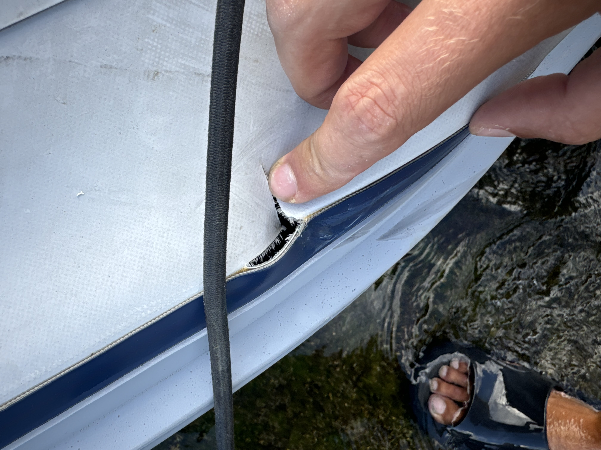
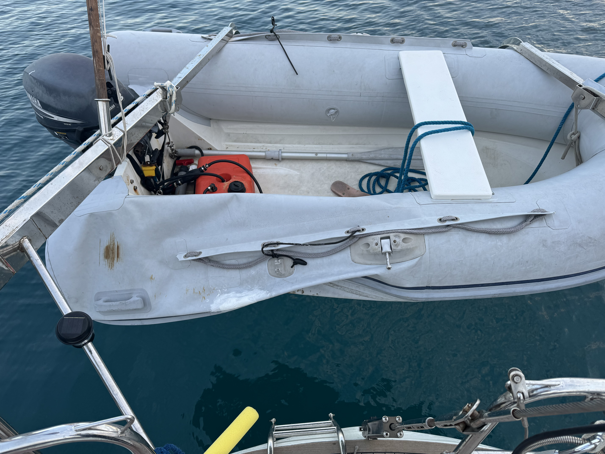

## inflatable no longer 
Our next issue was another nuisance - a spun prop on the outboard. It just happened to time itself when I had some guests come by. Not ideal. An easy fix - just had to wait for parts. 

It was when we had other guests that the next problem cropped up. The tender that had come with the boat (circa 2003) decided that it no longer needed air in one of its compartments. We had been looking at its seams with concern prior - and it gave me quite the surprise when this decided to give. 

I tried a bit of a bodge - however with a rip of that size, in that place, without proper tools (and minimal know-how) this was a futile effort at best. 

A new dingy would have to be acquired! Once our guests left. Of course this always seemed to happen when we had guests. 

