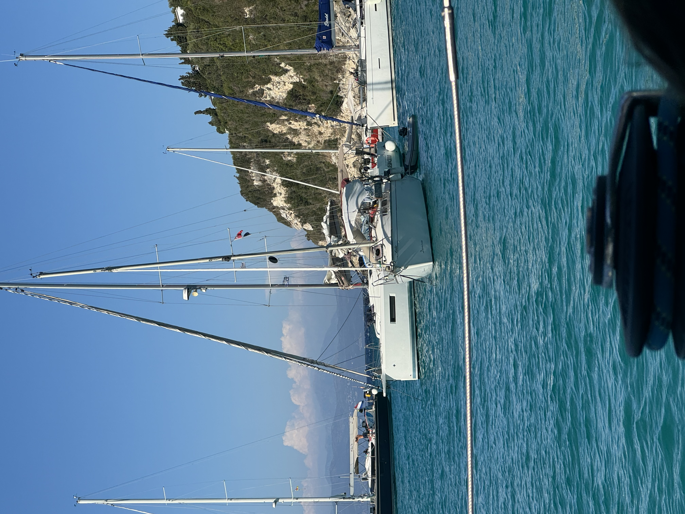

# You cant park here

Unlike a car, boats tend to move - even when parked. This turned out to be a rather fun challenge - how & where do you place your boat in the busy anchorages off the coast of Greece. 

The town of Lakka, on the island of Paxos is gorgeous. It is every bit an idyllic seaside town. It is a great anchorage, and very conveniently placed between the larger towns of Preveza/Lefkada & Corfu.  

This anchorage tight. Very tight. A fun example of that below, where these boats are happily smacking into each other as they spin around their anchors. 

We had our own fun with this one night as well. We had dropped anchor earlier in the day as far to the edge as possible - both to maximize the available space & to try and have as few people at risk of bumping into us as possible. 

A bigger (25m) motorboat anchored right beside us - close, but with what passes for enough room in a place like this. Great! No reasonable person would think to anchor between us, so we could relax. Then came the most dreaded of things - a charter catamaran. They came in between us and the motorboat, dropped anchor and immediately went for dinner. Five minutes later, the catamaran was up bumping against the motorboat. 

We finished changing out of swimwear so that we could go for dinner and paused to watch the people on the motorboat trying to signal to anyone on the catamaran that there was a problem - no luck. Then the catamaran started swinging our direction.

With two hulls, catamarans do not behave the same as monohulls at anchor. Two monohulls can reasonably expect to have a similar swing pattern on the anchor. A catamaran is different. Even then - they were too close. We had known that this anchorage was tight, and people did silly things - so we had all our fenders out. In a unique twist of fate, this was turned out to be unnecessary - our davits were the perfect height to make a couple nice dents in their boat, keeping our boat just far enough away. In a contest of fiberglass vs steel - steel wins. 

As the boat swung back towards the motor yacht, the people who had chartered this yacht came back from dinner - to some choice words from the people on the motorboat. This encouraged them to re-anchor a bit further away - and let us feel safe enough to go for dinner. 