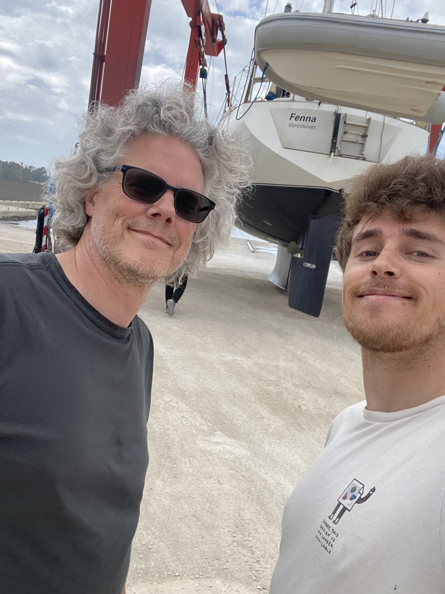
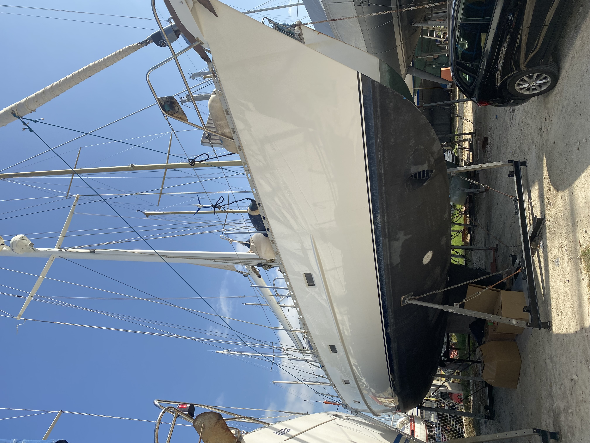
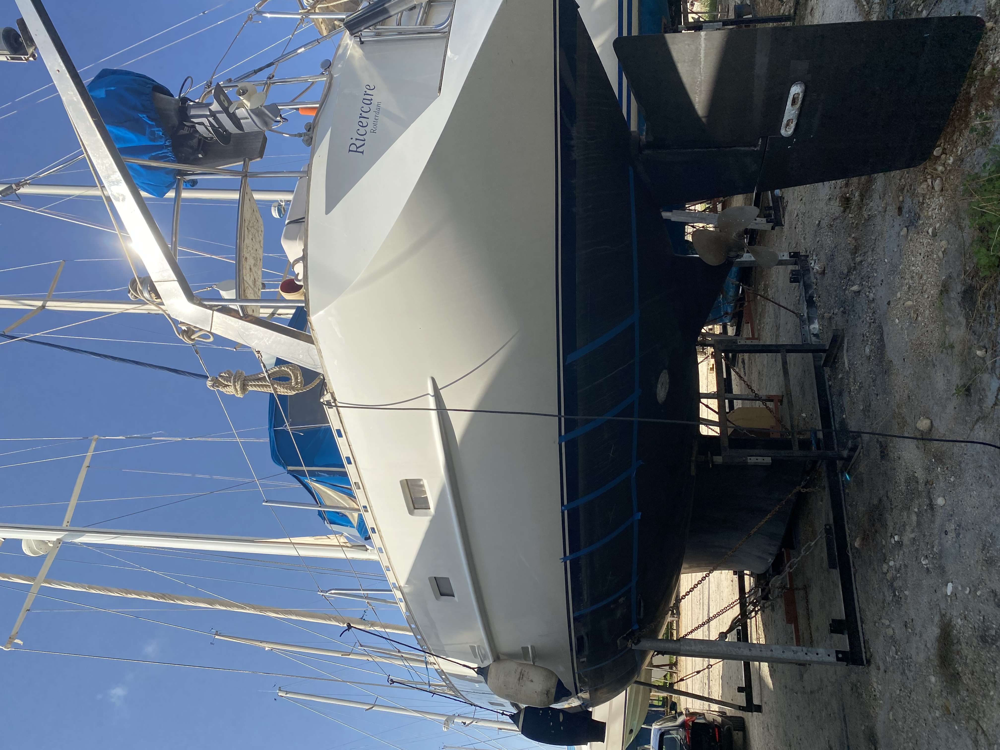

# Fenna

My father grew up in the Netherlands & England where sailing was a pastime of his. Going right from high school into naval college, ending up in the merchant marine as a radio officer - where he then travelled around the world.  One port of call he happened upon was Vancouver, Canada. This would be an important place, as in 1993 he immigrated there with my mother. Apparently the options were either that or Sydney, Australia - but the spiders down under were a no from my mom.

Thus, Vancouver - the place I was born and raised (and continue to call home!). This was where my father built a company, which he grew enough to make selling it & retiring feasible. His final meeting at the company he changed his background to a tropical beach - mentioning he was going to be off in the Caribbean - on a yacht. Thus began his search for an appropriate vessel.

It took years of searching for him to find one that was a mixture of the right type, size, price, quality, condition, and all of the other components one looks for in a yacht.  One fun requirement - Ceiling height. Standing at 6’2” he didn’t want to have to crouch the whole time. His search led him up and down the west coast of North America - with no real luck. As such, the search expanded across the globe. Eventually, he came upon something in Preveza, Greece - A yacht called the Ricercare.

This Nordia 49 Cruiser was built in 1993 by van Dam Nordia Yachts. Designed by Robert van Dam, she was originally called Natryna. Renamed to Ricercare around 2003 when she was purchased by a Dutch gentleman named Henk, she spent almost 20 years under his care - before at age 84 he decided it was time to part ways with her.  These are excerpts from then onwards - my father & me sailing around. 

Some pictures from the very first day I arrived at the boat:

[Gallery](Gallery/index.md)
[a couple of mishaps](a_couple_of_mishaps/index.md)
[mechanics, maintenance, oh my](mechanics_maintenance_oh_my/index.md)
[sailing the seas](sailing_the_seas/index.md)
