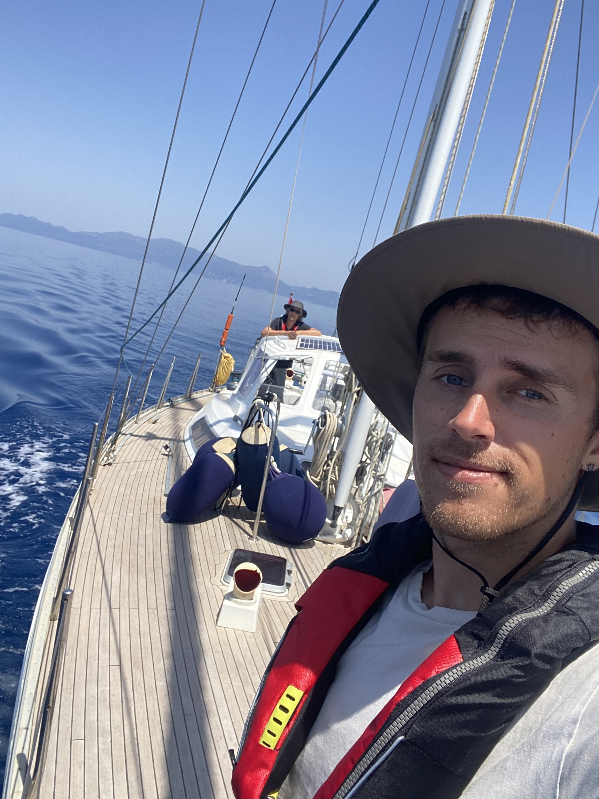
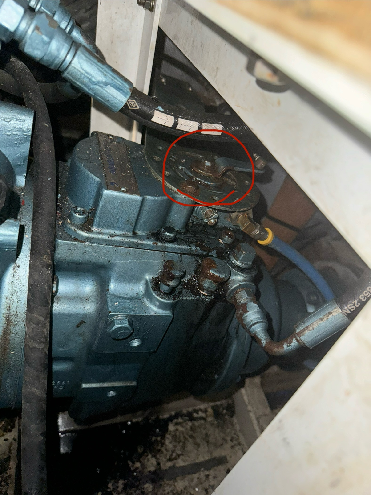
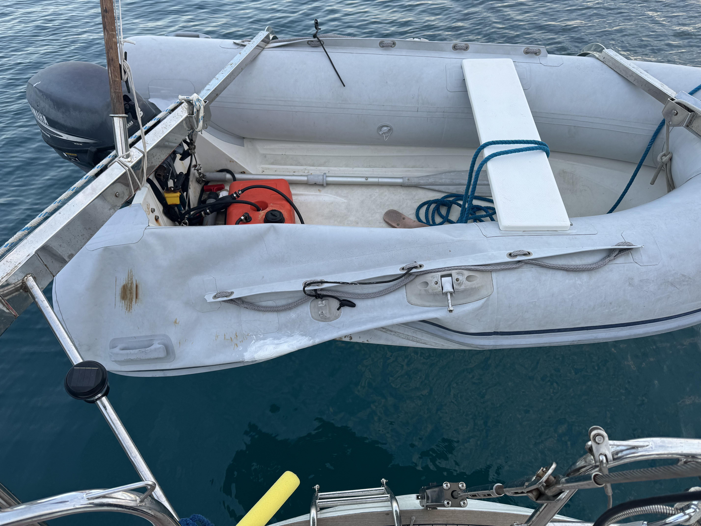
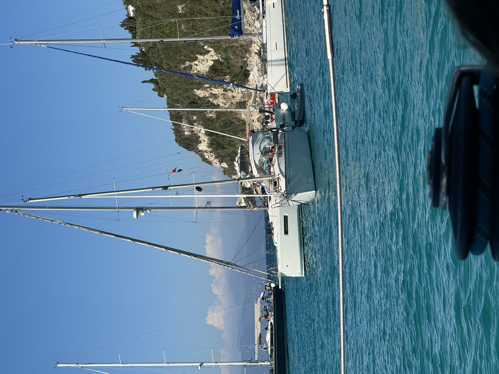
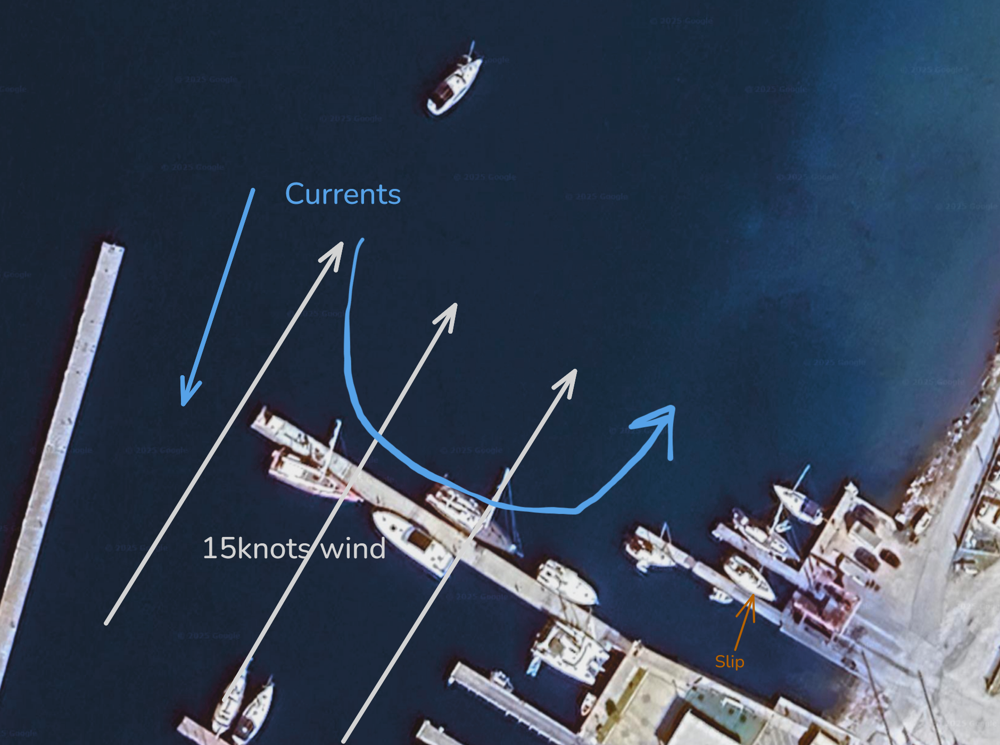
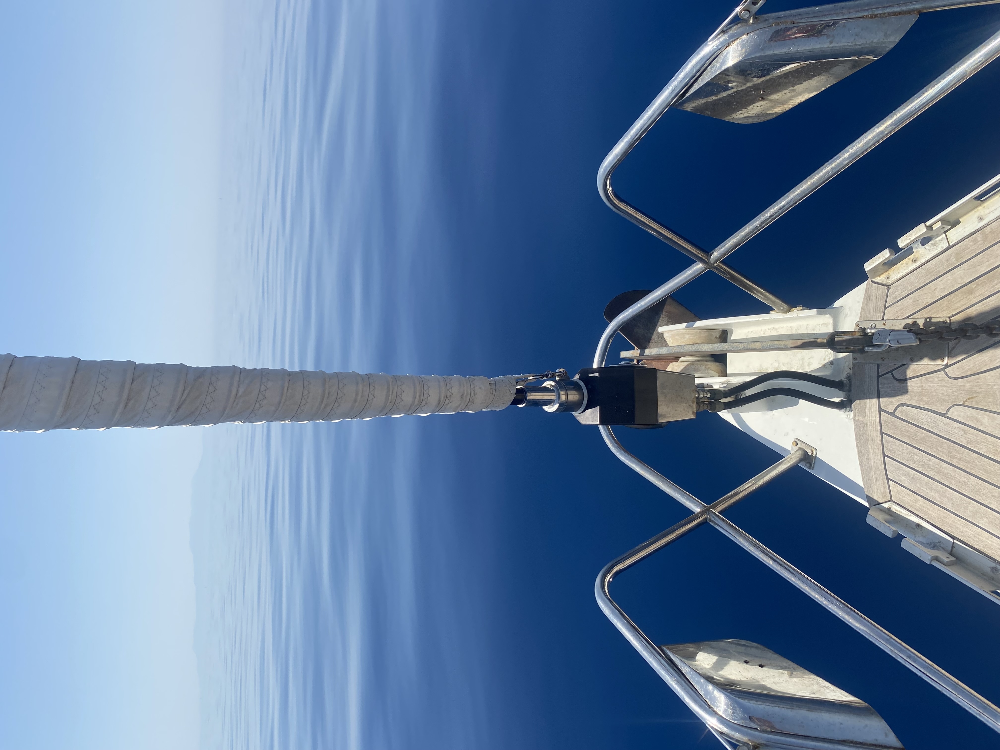

# Intro

My father grew up in the Netherlands & England where sailing was a pastime of his. Skipping high school he went straight into naval college, ending up in the merchant marine as a radio officer - where he then travelled around the world.  One port of call he happened upon was Vancouver, Canada. This would be an important place, as in 1993 he immigrated there my mother. Apparently the options were either that or Sydney, Australia - but the spiders down under were a no from my mom.

Thus, Vancouver - the place I was born and raised (and continue to call home!). This was where my father built a company, which he grew enough to make selling it & retiring feasible. His final meeting at the company he changed his background to a tropical beach - mentioning he was going to be off in the Caribbean - on a yacht. Thus began his search for an appropriate vessel.

It took years of searching for him to find one that was a mixture of the right type, size, price, quality, condition, and all of the other components one looks for in a yacht.  One fun requirement - Ceiling height. Standing at 6’3” he didn’t want to have to crouch the whole time. His search led him up and down the west coast of North America - with no real luck. As such, the search expanded across the globe. Eventually, he came upon something in Preveza, Greece - A yacht called the Ricercare.

This Nordia 49 Cruiser was built in 1993 by Van-Damme Nordia Yachts. Designed by Robert Van-Damme, she was originally called Natryna. Renamed to Ricercare around 2003 when she was purchased by a Dutch gentleman named Henk, she spent almost 20 years under his care - before at age 84 he decided it was time to part ways with her. 

# On the hard

After an inspection, a bunch of paperwork, and other preparation we arrived in Preveza - ready to get the boat on the water. Almost immediately after we arrived, the size of the task ahead of us began to grow.+. The boat was full of things - parts, tools, and other random items. Removing all of this and cleaning the boat to be comfortable took us over 3 months of work. 

In every compartment & drawer, under every sole in every bilge - there were things. So many things. We ran into a rather fun problem - was this component kept because it was a spare? broken? who knows! Another example was the stove - we thought we would need to buy a new one. It was black, and didn't spark or light. We gave it a thorough clean (4 full days work... cleaning a single stove) and it suddenly was back to its shiny stainless steel original self - and sparking again. 

This whole process, we were kept adding more and more to the list of things we wanted to fix, however it kept throwing new wrenches in the plan. One afternoon we smelled the rather distinct smell of burning. We pretty quickly isolated the problem to be the shore power inlet - which had been wired creatively. It had done a bit of melting. Not ideal.

There was a surprising benefit of this near catastrophic fire - being buried back in the cockpit locker allowed me to discover another unique feature of the boat - the diesel inlet spout was not connected to the tube that should route it into the diesel tank. (Sadly, couldn’t find pictures of that while it was broken - it was impressively bad). 

Traditionally, you connect the inlet to the tube that runs diesel into the tank. There was about a foot of nothing between the inlet and the tube. To this day I am still baffled at how this could have happened. 

I ended up having to re-run the whole tube - which requires tearing apart the engine room to access the diesel tank. In the end, a nice newly run blue tube from spout to tank. 

These delays, kerfuffle's, and other items meant that we didn't manage to get onto the water until the following spring. We thought it would be simple... We have been proven wrong about that - consistently. This has led to some interesting moments, though strangely - paperwork was our greatest challenge. Greek bureaucracy is not for the faint of heart. In Canada you can send an email. In Greece you might need to go to different three different towns to talk to five different people to get eight different papers... So that you can get the paper you need to apply to get the paper you actually need. 

However despite all that fuss, we got the new name stuck on the boat - "Fenna" (check out vessel trackers & other free AIS webpages - If we are on the water, you can find us!)

Put on the water, we were immediately greeted by the two local turtles doing a bit of a couples dance. Nice that. 

# On the water

It took a while - but we got there! The vivid colors of the Ionian Sea. 

# A couple of mishaps

## A bit of a tow 

We have had our share of mishaps. We encountered our first - and so far worst calamity very early on. We had been motoring around getting a feel for the yacht - when the engine cut out. No problem, we can troubleshoot that. After about an hour of faffing about - I still couldn't get the engine going. Alright, we can sail it in. Not ideal considering this would be our first time ever properly sailing the boat - but it would work. At a minimum, it will bring us closer to the town where would could ask for assistance. 

This started just fine, and was actually quite pleasant - a nice 15 knot wind pushing us along. As we got closer to the relatively tight channel, there was a thought - lets just test the process of bringing the sails in. Since we are going to be operating in tight, shallow waters - best we have at least practiced this maneuver. This was when things went from bad to worse. 

This yacht has hydraulic winches & furlers. We had tested these before we went out. They decided that right then was when they needed to fail. All of these hydraulic systems also have manual overrides. We had also tested these before. The wind had picked up, and was blowing us to shore with a nice 25 knots of wind. 

We managed to get the main sail in. Then we tried to get the Genoa in. This was when we learned that the furler for the foresail that should have wrapped the Genoa nicely around the forestay - was completely broken. With no engine, no hydraulics, no manual overrides, and a massive Genoa flapping about in decent winds; we decided discretion was the greater part of valor - and called for a tow in.

For the engine, it turns out that the switch that controlled the pump for the day tank had stopped working. This tank then emptied and the whole system ran dry. There is supposed to be an alarm for this (we have the manual for the alarm, a hand drawn diagram & everything...), however I suspect that this mythical alarm is aspirational at best. You are also supposed to be able to flip two handles and have it roll over to the main tank. The challenge here is that you need to bleed the system. By the manual, there is a tiny little lever on the lift pump that you can use to bleed the system. In practice - this is ineffective. We later had a local mechanic show us a trick - if you use the starter, it will run the lift pump - Just be careful not to burn out your starter motor. 

For the foresail - the hydraulic furler had completely broken. It had to be completely removed & shipped to Athens for a complete overhaul & rebuild. Nothing much we could do there. 

## an oily situation

One of the first bits of maintenance we did was an overhaul of the generator. It was in real need of a service - the heat exchanger was completely clogged. The coolant was more particles than liquid, and the rest of it was in a surprisingly rough condition considering it really only had 1300 hours on it. We swapped all the fluids, changed the impeller, gave it a good cleaning - the works. 

This turned out to be a mistake. Almost immediately, it proved to be troublesome. The diesel lines in kept sucking air - causing it to shut off randomly. The filters that had been left with the boat didn't fit quite right - causing an oily mess. 

The worst problem however, was that it seemed like every single gasket had simultaneously failed. The generator now had a slow, consistent leak - with the core of it being between the dynamo & the engine block. This generator was a large, bulky thing - near impossible to properly work, even in our admittedly large engine room. This oil leak caused other problems as well. Right below the generator - and more importantly below a hole in its catch pan lives the shift linkage for the main engine. 

> [!hint]- pan-pan, pan-pan, pan-pan - I am in the fish, I am in the fish
> On our way to anchor we heard a weird radio call on 16. Someone calling out a [pan-pan](https://en.wikipedia.org/wiki/Pan-pan) with a curious message - "I am in the fish". This turned out to be a some poor souls who had gone straight into one of the local fish farms. Still not quite sure how they pulled that off - however we did end up seeing them as they were pulled out by the coast guard. We ended up following them into the anchorage - where the authorities lingered around their boat to "chat" for a good while. 

You can imagine my surprise when I was attempted to maneuver to anchor - and the throttle no longer does anything. Happily - I was right near the anchorage at this point. A bit of inertia, a bit of the bow thruster, and I managed to get an "alright" spot. Only mildly stressful - especially considering the Greek coast guard was right in front of us dealing with another boat who was "in the fish" a moment prior. 

The oil had leaked onto the linkage, and had slowly come out. A couple twists of the wrench - and the throttle was back in action. Happily a quick fix. 

## inflatable no longer 
Our next issue was another nuisance - a spun prop on the outboard. It just happened to time itself when I had some guests come by. Not ideal. An easy fix - just had to wait for parts. 

It was when we had other guests that the next problem cropped up. The tender that had come with the boat (circa 2003) decided that it no longer needed air in one of its compartments. We had been looking at its seams with concern prior - and it gave me quite the surprise when this decided to give. 

I tried a bit of a bodge - however with a rip of that size, in that place, without proper tools (and minimal know-how) this was a futile effort at best. 

A new dingy would have to be acquired! Once our guests left. Of course this always seemed to happen when we had guests. 

## You cant park here
Unlike a car, boats tend to move - even when parked. This turned out to be a rather fun challenge - how & where do you place your boat in the busy anchorages off the coast of Greece. 

### Lakka
The town of Lakka, on the island of Paxos is gorgeous. It is every bit an idyllic seaside town. It is a great anchorage, and very conveniently placed between the larger towns of Preveza/Lefkada & Corfu.  

This anchorage tight. Very tight. A fun example of that below, where these boats are happily smacking into each other as they spin around their anchors. 

We had our own fun with this one night as well. We had dropped anchor earlier in the day as far to the edge as possible - both to maximize the available space & to try and have as few people at risk of bumping into us as possible. 

A bigger (25m) motorboat anchored right beside us - close, but with what passes for enough room in a place like this. Great! No reasonable person would think to anchor between us, so we could relax. Then came the most dreaded of things - a charter catamaran. They came in between us and the motorboat, dropped anchor and immediately went for dinner. Five minutes later, the catamaran was up bumping against the motorboat. 

We finished changing out of swimwear so that we could go for dinner and paused to watch the people on the motorboat trying to signal to anyone on the catamaran that there was a problem - no luck. Then the catamaran started swinging our direction.

With two hulls, catamarans do not behave the same as monohulls at anchor. Two monohulls can reasonably expect to have a similar swing pattern on the anchor. A catamaran is different. Even then - they were too close. We had known that this anchorage was tight, and people did silly things - so we had all our fenders out. In a unique twist of fate, this was turned out to be unnecessary - our davits were the perfect height to make a couple nice dents in their boat, keeping our boat just far enough away. In a contest of fiberglass vs steel - steel wins. 

As the boat swung back towards the motor yacht, the people who had chartered this yacht came back from dinner - to some choice words from the people on the motorboat. This encouraged them to re-anchor a bit further away - and let us feel safe enough to go for dinner. 

# Blue Waters

It really is picturesque off the coast of Greece. Some fun assorted photos

# Time to return home

After a whole summer, 1300NM, 1 57million Greek salads, 2 million souvlakis, and 100 million gyros - it was time to put the boat back up on dry land for the winter. 

Docking a boat is challenging. In this case, you are reversing 23 tons of yacht backwards - and it doesn't go straight. Out boat pulls heavily clockwise when going in reverse. 

Then lets add in a challenge - wind & currents. Trying to get into the slip where they would lift our boat out was one of the hardest maneuvers I did all year (and we did a lot of stern-to docking!) To illustrate what the currents and wind are doing:

This combination of forces results in your boat spinning, and shifting in a collection of directions - all while moving backwards towards concrete. Not for the faint of heart. Or for people easily influenced by people shouting suggestions onshore - as they may mean well (and may very well be giving good advice), however its often a bit too much information to handle at once. 

On our boat, reversing means a minimum of three simultaneous actions - throttle, helm, and bow thruster. One more than you have hands for. Add in the need to communicate with whoever is on deck - it becomes a rather stressful maneuver. I most certainly did not get this in first go.

With that - the boat goes back up! We will be back next year (2025) to continue cruising along. 

