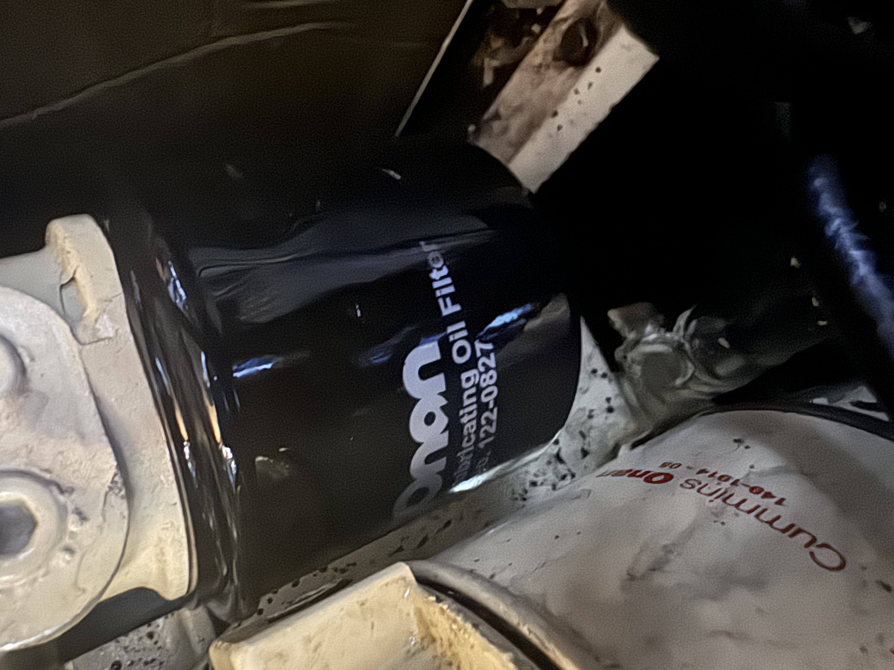

# An oily situation

One of the first bits of maintenance we did was an overhaul of the generator. It was in real need of a service - the heat exchanger was completely clogged. The coolant was more particles than liquid, and the rest of it was in a surprisingly rough condition considering it really only had 1300 hours on it. We swapped all the fluids, changed the impeller, gave it a good cleaning - the works. 

This turned out to be a mistake. Almost immediately, it proved to be troublesome. The diesel lines in kept sucking air - causing it to shut off randomly. The filters that had been left with the boat didn't fit quite right - causing an oily mess. 

The worst problem however, was that it seemed like every single gasket had simultaneously failed. The generator now had a slow, consistent leak - with the core of it being between the dynamo & the engine block. This generator was a large, bulky thing - near impossible to properly work on, even in our admittedly large engine room. This oil leak caused other problems as well. Right below the generator - and more importantly below a hole in its catch pan - lives the shift linkage for the main engine. 

This gave us a new problem - the [throttle was no longer connected to the engine](shifter_not_connected.md)
