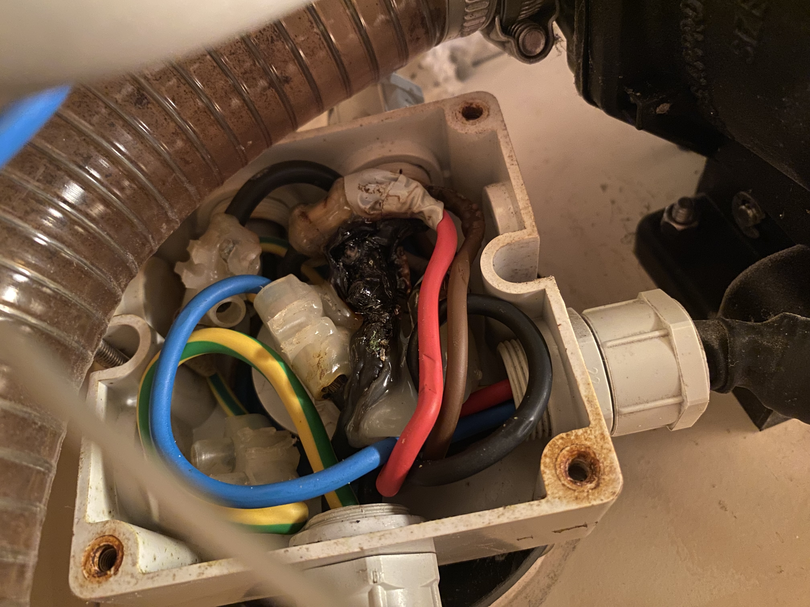
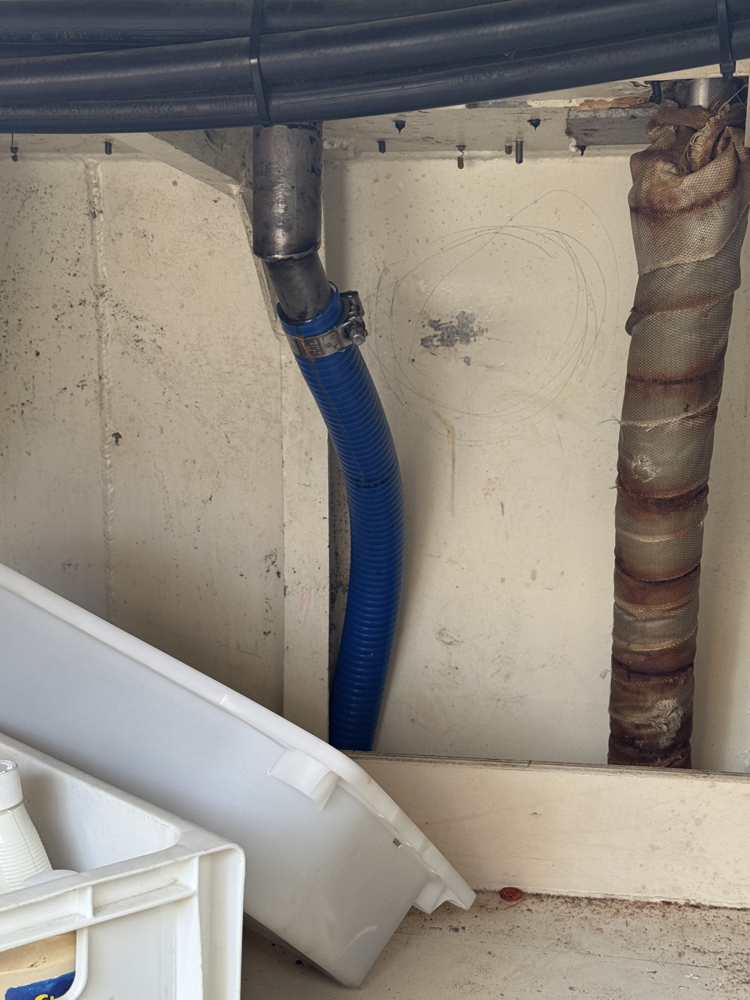

After an inspection, a bunch of paperwork, and other preparation we arrived in Preveza - ready to get the boat on the water. Almost immediately after we arrived, the size of the task ahead of us began to grow. The boat was full of things - parts, tools, and other random items. Removing all of this and cleaning the boat to be comfortable took us over 3 months of work. 

In every compartment & drawer, under every sole in every bilge - there were things. So many things. We ran into a rather fun problem - was this component kept because it was a spare? broken? who knows! Another example was the stove - we thought we would need to buy a new one. It was black, and didn't spark or light. We gave it a thorough clean (4 full days work... cleaning a single stove) and it suddenly was back to its shiny stainless steel original self - and sparking again. 

This whole process, we were kept adding more and more to the list of things we wanted to fix, however it kept throwing new wrenches in the plan. One afternoon we smelled the rather distinct smell of burning. We pretty quickly isolated the problem to be the shore power inlet - which had been wired creatively. It had done a bit of melting. Not ideal.

There was a surprising benefit of this near catastrophic fire - being buried back in the cockpit locker allowed me to discover another unique feature of the boat - the diesel inlet spout was not connected to the tube that should route it into the diesel tank. (Sadly, couldn’t find pictures of that while it was broken - it was impressively bad). 

Traditionally, you connect the inlet to the tube that runs diesel into the tank. There was about a foot of nothing between the inlet and the tube. To this day I am still baffled at how this could have happened. 

I ended up having to re-run a whole new tube - which requires tearing apart the engine room to access the diesel tank. In the end, a nice newly run blue tube from spout to tank. 
