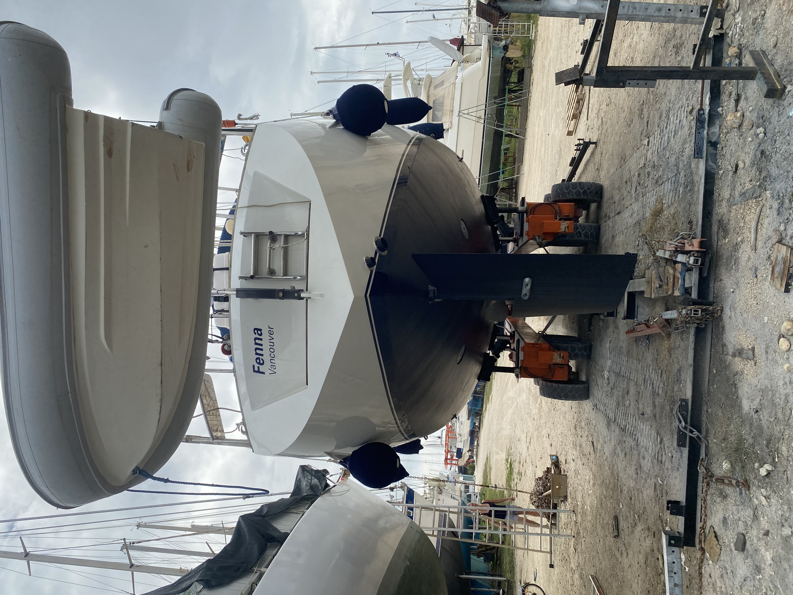

# Time to return home

After a whole summer, 1300NM, 1 57million Greek salads, 2 million souvlakis, and 100 million gyros - it was time to put the boat back up on dry land for the winter. 

Docking a boat is challenging. In this case, you are reversing 23 tons of yacht backwards - and it doesn't go straight. Out boat pulls heavily clockwise when going in reverse. 

Then lets add in a challenge - wind & currents. Trying to get into the slip where they would lift our boat out was one of the hardest maneuvers I did all year (and we did a lot of stern-to docking!) To illustrate what the currents and wind are doing:

This combination of forces results in your boat spinning, and shifting in a collection of directions - all while moving backwards towards concrete. Not for the faint of heart. Or for people easily influenced by people shouting suggestions onshore - as they may mean well (and may very well be giving good advice), however its often a bit too much information to handle at once. 

On our boat, reversing means a minimum of three simultaneous actions - throttle, helm, and bow thruster. One more than you have hands for. Add in the need to communicate with whoever is on deck - it becomes a rather stressful maneuver. I most certainly did not get this in first go.

With that - the boat goes back up! We will be back next year (2025) to continue cruising along. 

