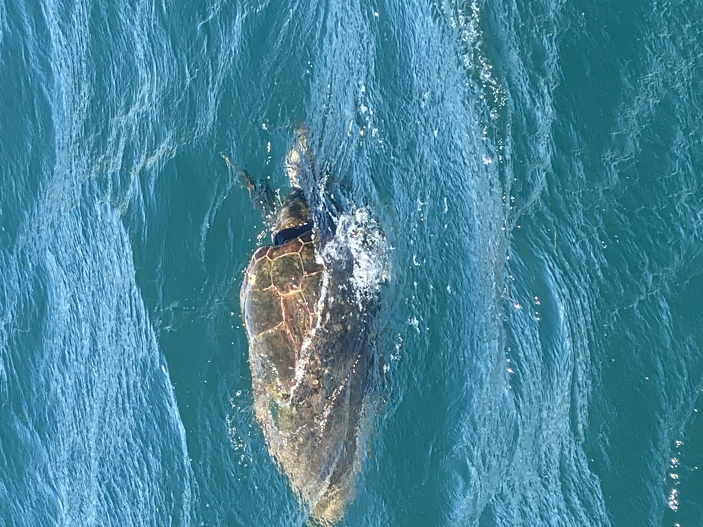
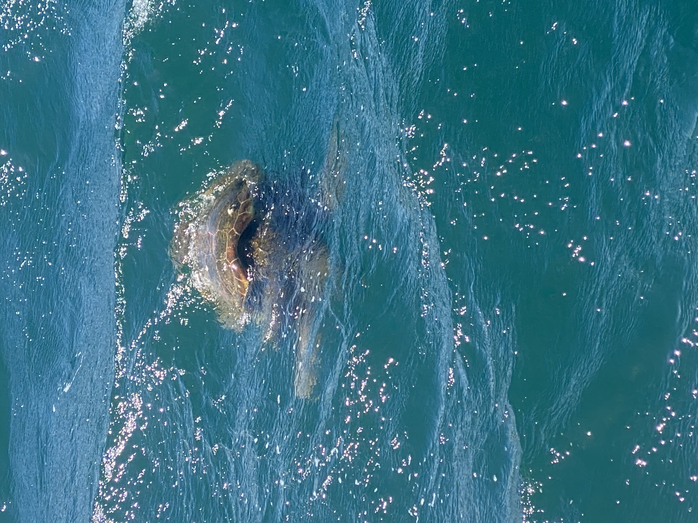

# Launch Day

These delays, kerfuffle's, and other items meant that we didn't manage to get onto the water until the following spring. We thought it would be simple... We have been proven wrong about that - consistently. This has led to some interesting moments, though strangely - paperwork was our greatest challenge. Greek bureaucracy is not for the faint of heart. In Canada you can send an email. In Greece you might need to go to different three different towns to talk to five different people to get eight different papers... So that you can get the paper you need to apply to get the paper you actually need. 

However despite all that fuss, we got the new name stuck on the boat - "Fenna" (check out vessel trackers & other free AIS webpages - If we are on the water, you can find us!)

Put on the water, we were immediately greeted by the two local turtles doing a bit of a couples dance. 

 
 
