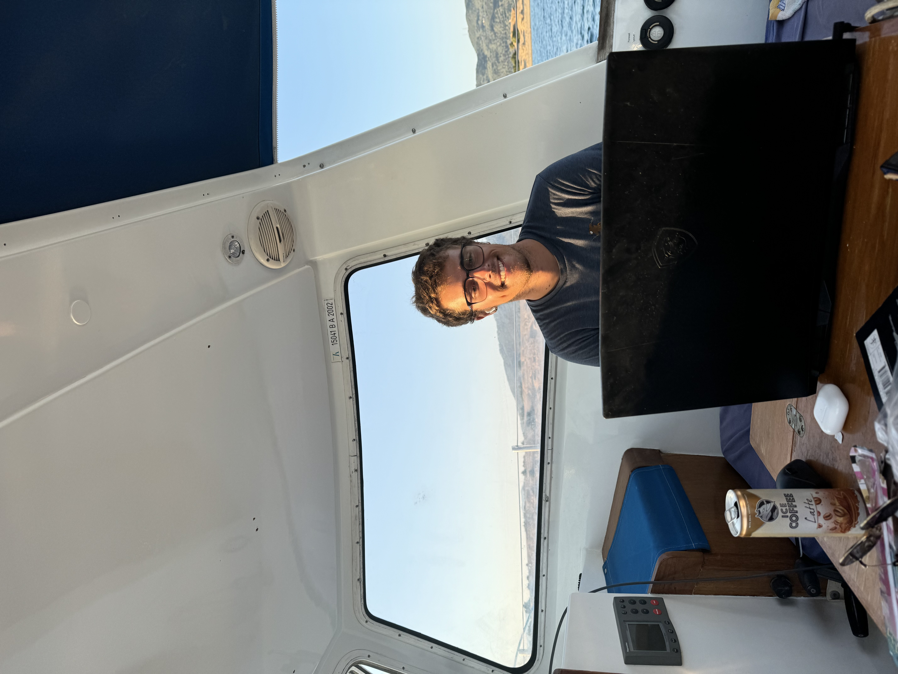
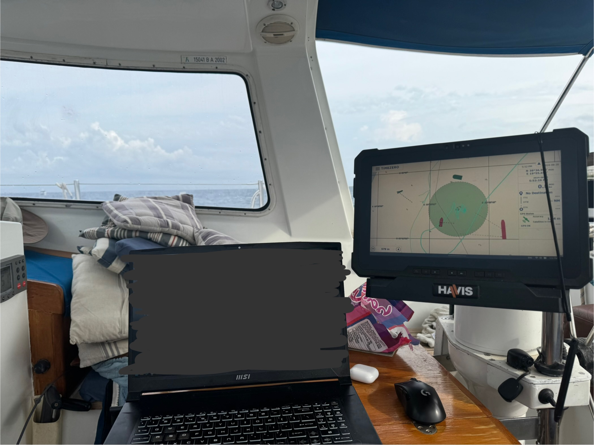

I have been working at sea! Quite nice. 

I have a server at home in Vancouver that technically hosts & does everything. A laptop to securely connect to it - and I am working in Canada! Technically, being on a Canadian flagged yacht also puts me in Canadian jurisdiction (well; once outside of territorial waters...).

While I have a "better" setup down in the hold (more monitors) - this is a fun way to work. 

watching the boat at anchor while I work:

