### Preface

I found in my travels around the web that the guides for setting up HTTPS are a tad scattered. While you might be able to find a guide for setting up the components individually, they rarely come together as a single piece (or they come in a 20+ minute video guide - not my favorite format).

As this task has tons of little parts, I made my own documentation. Then I wanted to share it with a friend. Then I realized with a bit more tweaks, this could be useful for everyone - and thus this document was born.

I am a big big fan of simplicity. If something is not simple (and thus unclear) - let me know so I can iterate & improve.

> [!summary] Objective 
> Configure HTTPS using a Reverse Proxy - Using only the pfSense network appliance 

> [!hint] Required Knowledge
> You will need some familiarity with the following:
> 
> - [ ] DNS records &amp; your domain registrar
> - [ ] pfSense GUI

> [!attention]- Requirements
> - [ ] Pfsense Firewall | [https://docs.netgate.com/pfsense/en/latest/](https://docs.netgate.com/pfsense/en/latest/)   
>     
>     - [ ] HAProxy Package | [https://docs.netgate.com/pfsense/en/latest/packages/haproxy.html](https://docs.netgate.com/pfsense/en/latest/packages/haproxy.html)
>     - [ ] ACME Package | [https://docs.netgate.com/pfsense/en/latest/packages/acme/index.html](https://docs.netgate.com/pfsense/en/latest/packages/acme/index.html)
> - [ ] Domain | Domain registrar of your choice
> - [ ] (OPTIONAL/RECOMMENDED) Cloudflare Account | [https://www.cloudflare.com/en-ca/plans/free/](https://www.cloudflare.com/en-ca/plans/free/)

> [!attention]- Versions
> pfsense CE 2.7.2
> HAProxy 0.63_2
> ACME 0.9.1

> [!danger]+ Risks
> By following this guide you WILL be exposing your network to the public internet. This is required for sites/services to function over the public internet.
> 
> Making anything publicly available to the internet is inherently a risk. 
> 
> - You, as the person following this guide are responsible for the security of what you configure.
> - You, as the person reading this guide are responsible for ensuring that you are following best practices.
> - You, as the person configuring a resource are responsible for maintaining it.
> 
> The safest way to manage a network is to not expose it in the first place.

#####  Traffic Flow   

This diagram is intended to give you a rough idea of the flow of traffic once setup:
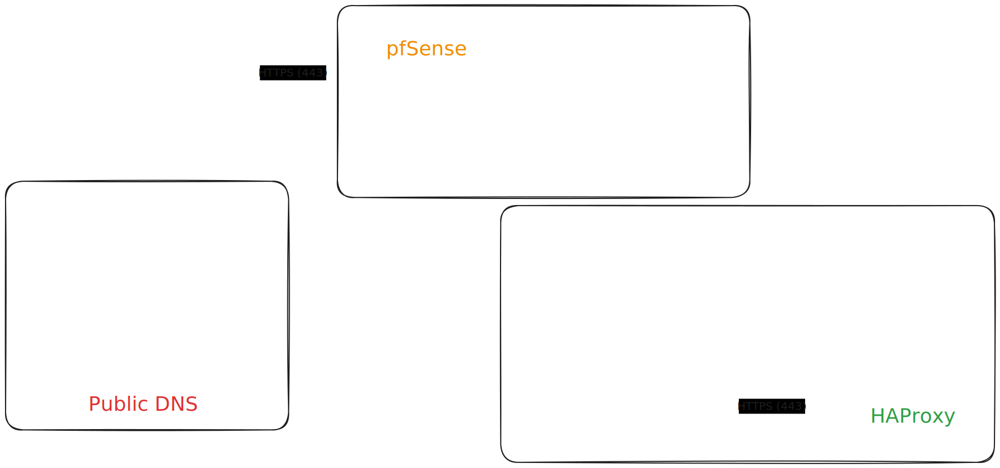
*(Keep in mind this diagram is intended to illustrate the items configured as a part of this document - and not intended as a true technical reference)*

## Public DNS Records

### Set Public DNS Records to Point at Host 

This is required to have a certificate generated with LetsEncrypt. You may need to give this record some time to propagate.

#### Setup DDoS Protections via Cloudflare

Cloudflare is THE name in the game for this. The free plan gives you enough to start. Once you hit the limits of that plan, its probably worth paying for the next tier.

- [https://www.cloudflare.com/en-ca/plans/free/](https://www.cloudflare.com/en-ca/plans/free/)
- [https://www.cloudflare.com/en-ca/ddos/](https://www.cloudflare.com/en-ca/ddos/)
- [https://developers.cloudflare.com/ddos-protection/get-started/](https://developers.cloudflare.com/ddos-protection/get-started/)
- [https://cf-assets.www.cloudflare.com/slt3lc6tev37/58Znmio29pRXDLKoQgNIz4/5cf1a6d3b1b1f5f1ea995460e04eb512/BDES-2587-Design-Wrap-Refreshed-DDoS-White-Paper-Letter.pdf](https://cf-assets.www.cloudflare.com/slt3lc6tev37/58Znmio29pRXDLKoQgNIz4/5cf1a6d3b1b1f5f1ea995460e04eb512/BDES-2587-Design-Wrap-Refreshed-DDoS-White-Paper-Letter.pdf)

## SSL Certificate

The instructions here are using the ACME package installed on pfSense to handle certificates.

You can also manually import a certificate from an SSL provider via the System -&gt; Certificates GUI in pfSense

I would recommend doing a DNS challenge to get your certificate. It provides a bit more than the older HTTP-01 method. See source documentation for more detail: [https://letsencrypt.org/docs/challenge-types/](https://letsencrypt.org/docs/challenge-types/)

If you run into issues [https://letsdebug.net/](https://letsdebug.net/) is a great resource.

### Setup Account Key

This is required for LetsEncrypt to know "who" is sending a request.

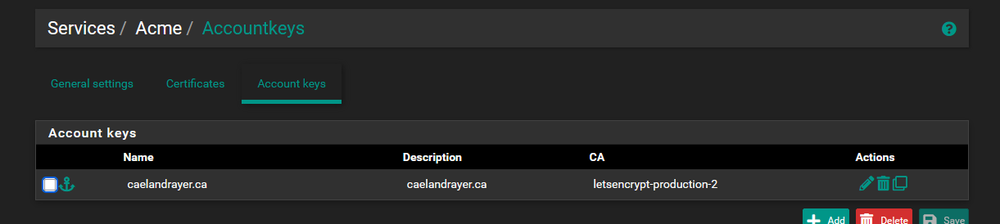
### Create SSL Certificate Request Template

Using the DNS Registrar Namecheap as an example, enter the fields here to create your certificate template (you will likely need an API key from your DNS registrar)

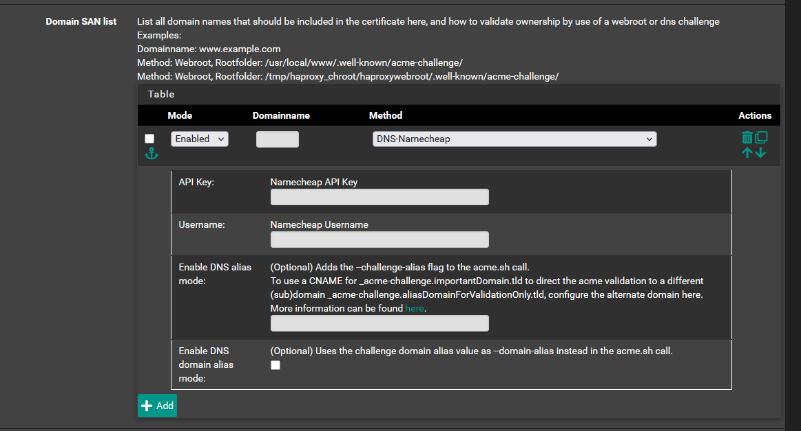
### Issue a Certificate

You will need to trigger an issuance. You can see if a certificate is available easily by the "Last renewed" column -- it should have content. Otherwise - hit the Issue/Renew button. This request might take a minute or so - you can move on and check later.

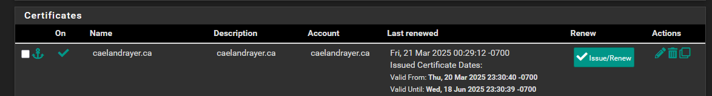
## pfSense / Networking

### Create a Virtual IP

This is the address that we will have HAProxy listen to requests on. This virtual IP will be used as a kind of loop-back target.

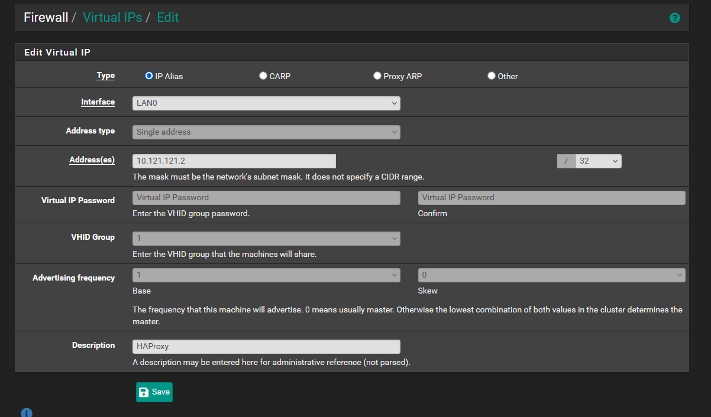
### Create NAT Rules / Port Forwards

THIS STEP WILL OPEN YOUR WAN ADDRESS TO INCOMING TRAFFIC BY DEFAULT:

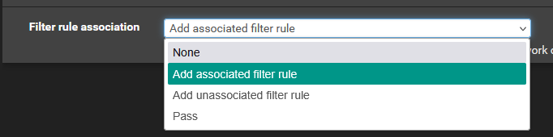]

When you are creating a NAT rule using the GUI it will select the option "Add associated filter rule". This means that whatever port you are forwarding will also get rules created to pass the traffic.   

We are going to want to create the NAT rules / Port forwards for ports 80/443 and send them to the virtual IP configured above

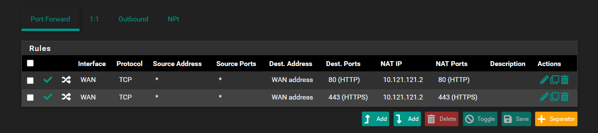

This will automatically generate two filter rules for you on the WAN interface:
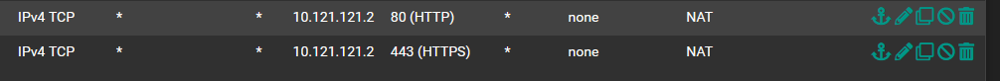
### Setup DNS Resolver Domain/Host Overrides

This helps ensure that traffic is flowing correctly to the Virtual IP we intend to have HAProxy listen to. The lookup server IP address should be the virtual IP configured above
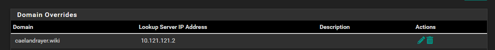

(In some environments/setups this might not be required - Those setups would require other changes to this guide)

## HAProxy

### Create HAProxy Backend

This is where HAProxy should send the traffic it receives.

the "Name" fields are descriptive - not functional.

the "Address" field should be the LAN/Local IP of the service

the "Port" field is the port the service is listening on

> [!tip] Every unique service will require its own unique backend

### Configure HAProxy HTTP Frontend to Redirect to HTTPS

This Frontend will listen on the virtual IP for HTTP (80) traffic:

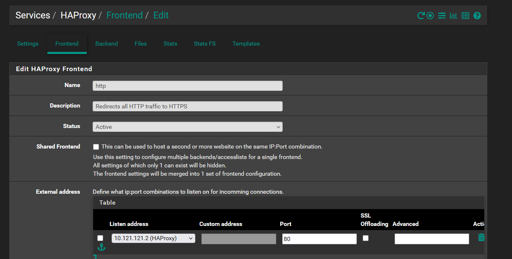

Then configure an action to redirect traffic to https:
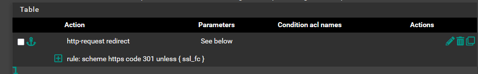
The settings do the following:

- scheme https = an instruction to change the traffic to https
- code 301 = tells the browser to cache this change
- unless { ssl\_fc } = is a bypass if they are already using https. Prevents some loop behaviours.

[https://www.haproxy.com/blog/redirect-http-to-https-with-haproxy](https://www.haproxy.com/blog/redirect-http-to-https-with-haproxy)

> [!faq]+ Why don't we just block HTTP Traffic?   
> In this day and age HTTP should not be used. You also don't really want clients able to connect over HTTP. Which then raises the question - why don't we just block HTTP?
> 
> If you type "caelandrayer.ca" into a browser, it can default to HTTP. End-users are unlikely to have a firm understanding of this behaviour, and just believe the site to be down/broken. Redirecting ensuring that no matter how users access your site - they end up in the right place.
> 
> While this is less of an issue nowadays, there also are some API/SEO things that would be impacted.

> [!faq]+ Okay, I have HTTP redirected - Does that mean I am safe?
> Nope! Unfortunately there is still a risk here. Since the user is connecting without a certificate initially, there is a chance something like a MiTM attack could do something malicous.
>
> To mitigate as much of that risk as we can, we use HSTS:
>- [https://hstspreload.org/](https://hstspreload.org/)
>- [https://www.haproxy.com/blog/haproxy-and-http-strict-transport-security-hsts](https://www.haproxy.com/blog/haproxy-and-http-strict-transport-security-hsts)
>
>We configure this below in the HTTPS Fronted actions.

### Configure HAProxy HTTPS Frontend

This is the Frontend set to to handle all incoming HTTPS traffic

You will need to tell it to listen for traffic on the virtual IP we have used throughout this process. You will also want to enable SSL Offloading here.
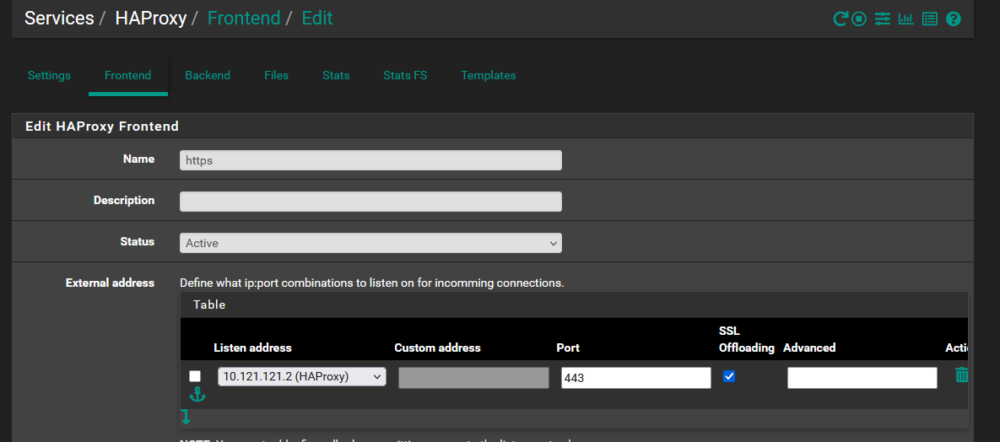
Then, you will need to configure an Access control list (ACL). It can be thought of as a way to "tag" traffic so that it can be actioned.
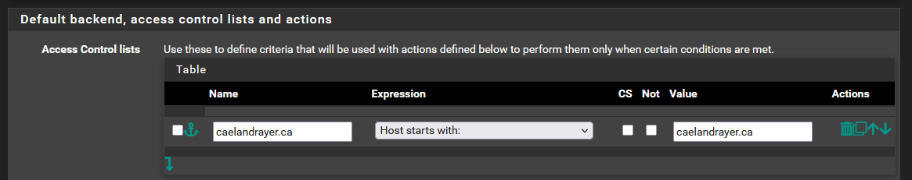
Create an action. When traffic matches an ACL rule (The ACL rule name from above and "Condition acl names" field must be exact matches), it will apply the action described. In this case, we are telling it to "Use Backend"" "caelandrayer.ca".

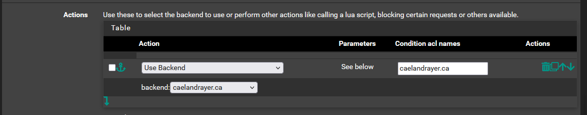
You will then ALSO need to create an HSTS header:

name= `Strict-Transport-Security`  
fmt= `"max-age=16000000; includeSubDomains; preload;"`
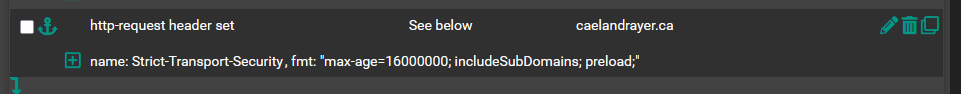

> [!tip] Every unique service will require their own ACL rule & action

Optional, but you will may want to have this setting enabled:
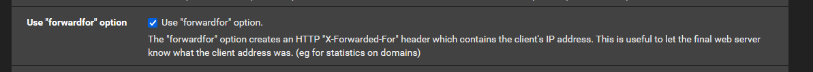
Choose the primary certificate you want to use for SSL offloading. This will have the pfSense device handle certificate validation
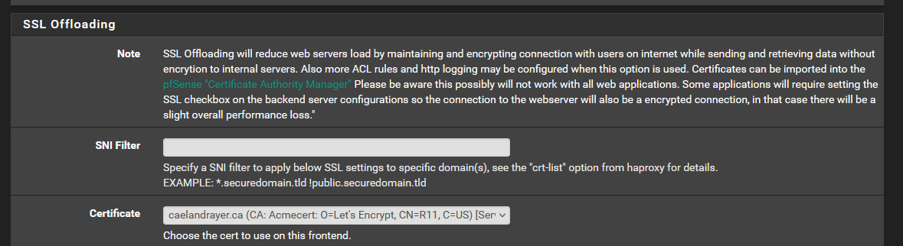

> [!tip]- Every unique service will require a certificate. If you are configuring another site for HTTPS you would need to add the certificate to the "Additional certificates" menu option
> 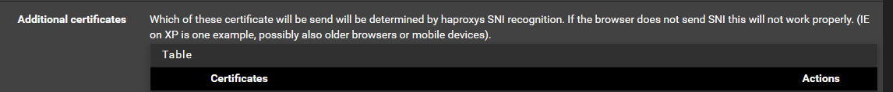
>  

### Enable HAProxy 

You will need to ensure HAProxy is enabled. Also ensure you set the "Maximum connections" to something appropriate to your device.

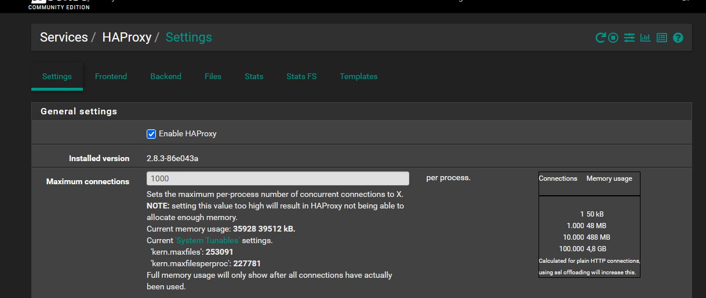

## Give it a Test

Confirm the following, and you should be done!

- Does it redirect from HTTP to HTTPS?
- Does it provide a valid certificate?