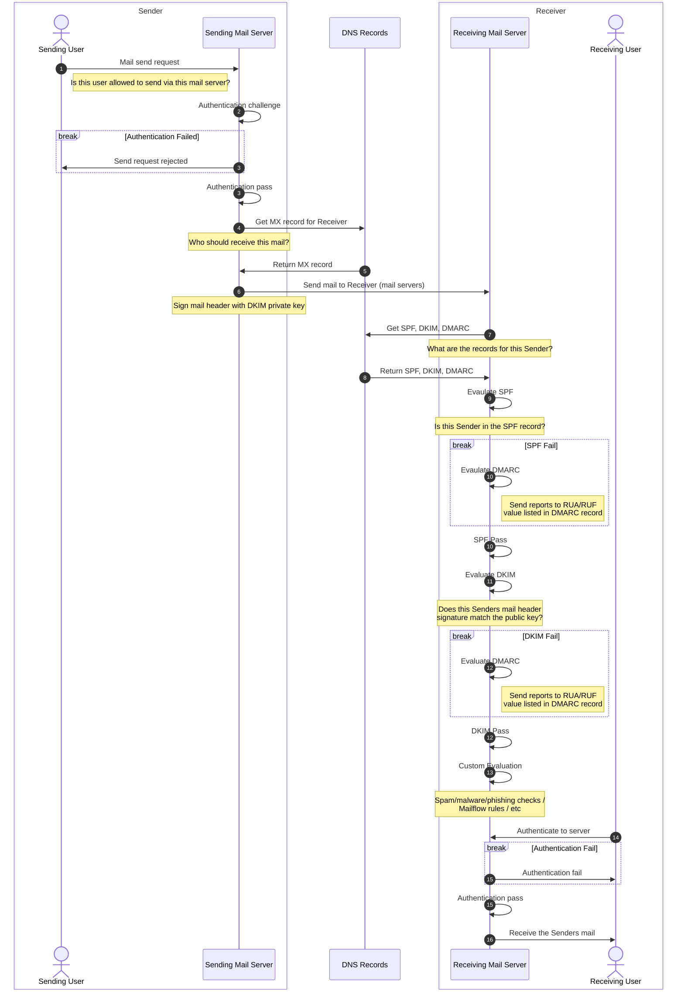

This is a primer on the core components of email - with a handy sequence diagram to walk you through the parts. 

# Email Authentication

Email Authentication are the methods in which we ensure that the email being sent/received is "authentic".

> [!example]- Want to spoof an email yourself? (Please don't...)
> It can really help illustrate why all of these things are important by demonstrating how easy it is to spoof an email.
> 
> If you go into your mail client of choice, you will note there is a "from" field (It is hidden by default in Outlook) - Add in a new/custom address
> 
> Congratulations! You are now spoofing an email address. 
> 
> *While it would actually require a step or two more to actually work - in concept this is all that is required.* 
 
> [!hint]+ Email Authentication Best Practices
> The "Messaging, Malware and Mobile Anti-Abuse Working Group" (M3AAWG)  have a very comprehensive guide on best practices for email authentication. Take a read!
>[ M3AAWG Email Authentication Recommended Best Practices](https://www.m3aawg.org/sites/default/files/m3aawg-email-authentication-recommended-best-practices-09-2020.pdf)

There are a 4 key components of modern email authentication - and all of them should be contained in a domains public DNS records. 

| Acronym | Formal Name                                                 | Standard                                               | Purpose                                                                                                                                       |     |
| ------- | ----------------------------------------------------------- | ------------------------------------------------------ | --------------------------------------------------------------------------------------------------------------------------------------------- | --- |
| MX      | Mail Exchange                                               | [RFC974](https://www.rfc-editor.org/rfc/rfc974.html)   | Instructs senders where to direct mail for a domain                                                                                           |     |
| SPF     | Sender Policy Framework                                     | [RFC7208](https://www.rfc-editor.org/rfc/rfc7208.html) | A list of who is an authorized sender for a domain                                                                                            |     |
| DKIM    | DomainKeys Identified Mail                                  | [RFC6376](https://www.rfc-editor.org/rfc/rfc6376.html) | Using public-key cryptography, the sender signs the email header. The receiver checks the signature to ensure email was transmitted correctly |     |
| DMARC   | Domain-based Message Authentication, Reporting, Conformance | [RFC7489](https://www.rfc-editor.org/rfc/rfc7489.html) | Instructs receivers on what to do with mail that does not pass SPF/DKIM for a domain                                                          |     |

> [!caution] Okay, I have all these records setup. Is that enough?
> If you are  sending mail? Yep! 
> 	Though you might need/want a mail server...
> 
> If you are receiving mail? Nope! 
> 	This just ensures that mail is authentic - It doesn't check if it is spam/phishing/malware etc. You will need to configure additional protections for that. 

Sequence workflow to help illustrate what happens when:

