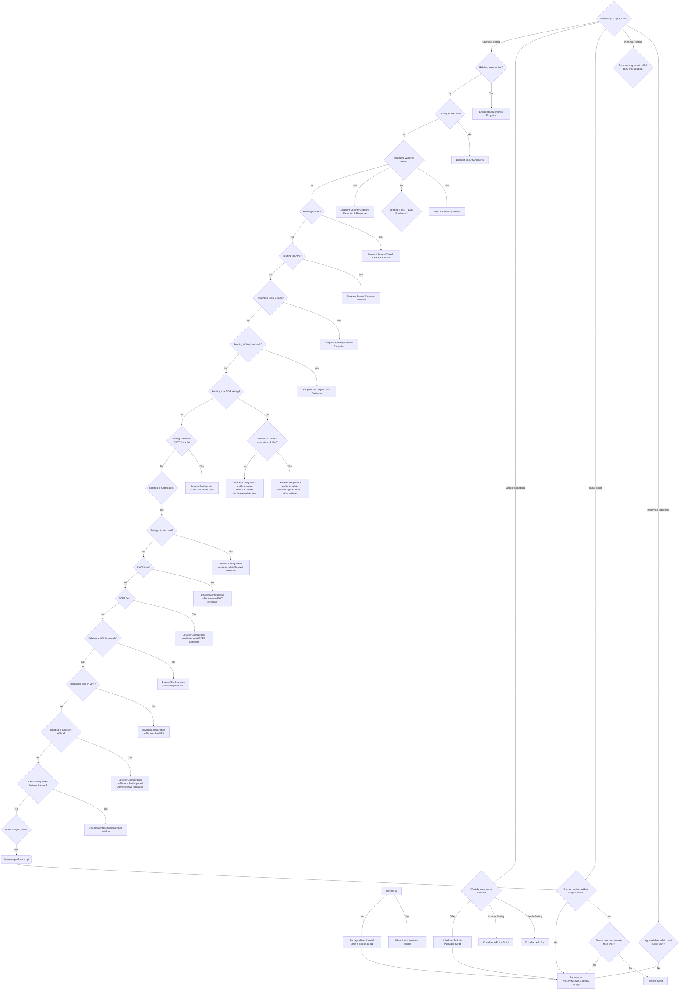

# Preface
Intune is Microsoft's unified endpoint management solution. It has spent a few years maturing - and really provides a great feature set. Getting the full use of this feature set can be challenging - and some things are not as intuitive as one would like. I have been using Intune daily for almost 5 years; and have fleshed out some method and design considerations to getting things done. 

One of the key issues I have noted working with others in Intune - is the overall question of "Where do I do x / How do I do y?". I have built out a flowchart to send people in the right direction.  

> [!abstract]- Endpoint Security Blade versus Device Configuration
> I have made the choice to move settings that could be in a device configuration into the Endpoint Security blade. This is because of:
>
>1 - **Readability** - The GUI provided tends to be more human readable, and provide better tooltips
>
>2 - **Organization** - This approach standardizes locations amongst organizations; and prevent settings relating to a different function sneaking their way into what should be unrelated policies
> 
> 3 - **Microsoft** - Microsoft has been slowly but surely updating and improving this experience. Going with the flow seems appropriate here. 

> [!abstract]- Settings Catalog versus Templates
> I have made the choice to suggest that some things should be in a template versus a settings catalog policy. For some things this a requirement, for some things this is a preference.
> I tend to find that the templates are great when doing the basics. I would suggest take a look through the templates before using the settings catalog.
> 
> This does sometimes become an issue when the template is missing just one small setting you might expect. I would recommend not having things require two unique policies when it should be one. You will need to make a call on what is best for your purposes

> [!faq]-  This flowchart is a continual work in progress. Have something you aren't sure about how to achieve via Intune? Ask! I will happily add it in. 

> [!tip]- Welcome, to what is quite frankly a ridiculous flowchart. Happily - you can search it with CTRL-F.
> You can use Shift+MouseWheel or Num+/- to zoom 
> You when zoomed in; Shift-Click to pan

 
